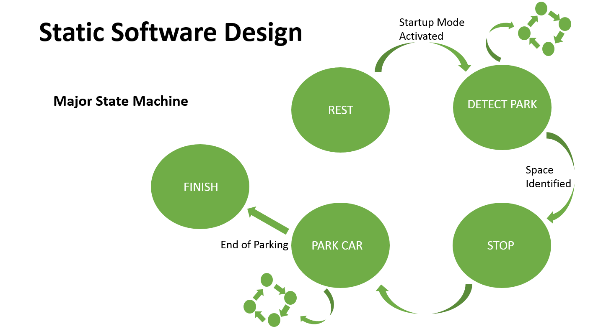
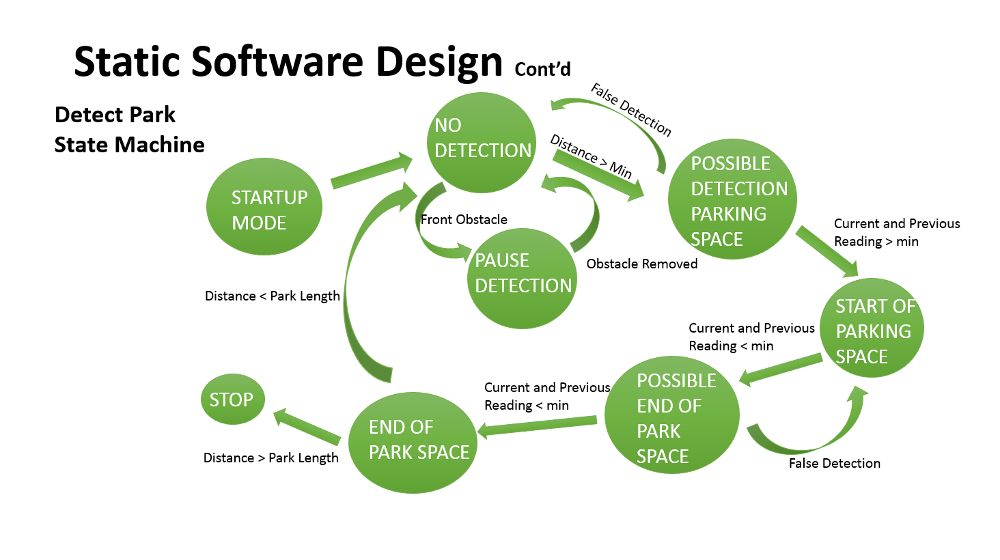
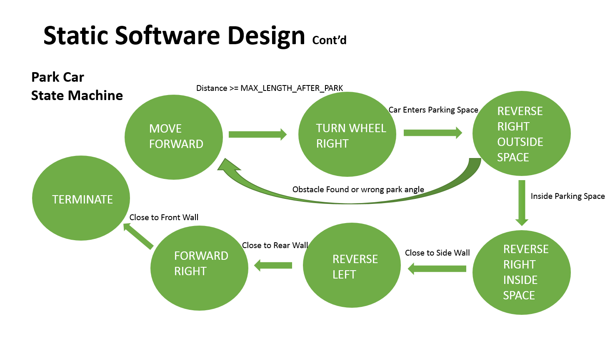
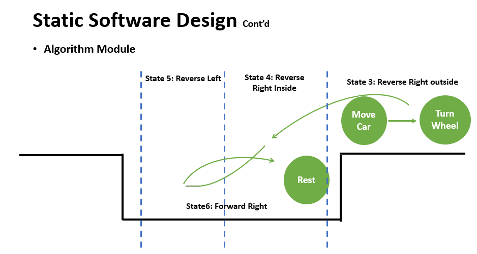

# Auto-Parking-Algorithm
Designed an Auto parking algorithm using state machine concept and implemented it in a RC car. The software is designed using C language and deployed in arduino target. This code could be deployed in any 4 wheeled vehicle with 2 motors, one to move it front/back, and the other to steer the vehicle left/right, and atleast 4 ultrasonic sensor for both sides, at the front and the back to sense the environment round the vehicle.

The algorithm is designed as follows:
It switched between three state machines; A general state machine defines general 5 states of the vehicle (Rest - DETECT_PARK - Stop - Park Car - Finish), two of them (DETECT_PARK , Park Car) each one has another sub-state-machine.

# Major State Machine

  
   

It starts off in REST State. In this state, the car is at rest. It gives enough time for all transients in the car to stabilize. Once everything is stable, it moves to DETECT_PARK State.
In DETECT_PARK State, car moves forward till it detects a parking spot.
Once a parking lot has been detected, the state machine moves into Park Car State. It remains in Park Car State until the car has parked itself.
Once the car has been parked, master state machine moves onto Finish State.
When we this State, the car parked itself. The car will eternally remain in this state hereafter, since the car has parked itself and is at rest.

# DETECT_PARK State Machine

  
   

STARTUP MODE State serves as a start-up. This is essential because the first few cycles the side distance sensor is still calibrating itself. Once the wait state is done, the state machine enters NO DETECTION State, where it searches for a sudden increase in the side distance value. A sudden increase corresponds to the beginning of a parking space. When this does occur, the state machine goes onto POSSIBLE DETECTION PARKING SPACE State.

In this State it attempts to confirm that it already detected a valid space. Once the side sensor reads an eligable distance (Width) for parking, the system moves to START OF PARKING SPACE State and a time sample will be stored, the sensor measures the disance for every cycle till this distance diminished then the state machine enters POSSIBLE END OF PARK SPACE state and another time sample is stored. By subtracting the two time samples and knowing the vehicle velocity in the END OF PARK SPACE State, the longitudinal parking distance could be check if it's eligible or not in this State, in order to take its decision whether to return back to NO DETECTION state or to go to STOP State

# Park Car State Machine

  
   

The function of the park Car state machine is to park the car once a parking spot has been identified. The algorithm to park the car continuously interacts with its surroundings through the forward, side and rear sensors.

The park Car state machine tries to simulate how a human would parallel park. It is don just by the following 4 motions:
1.	Reverse Right until you are inside the parking lot.
2.	Go Forward and redo 1. if the car is not aligned.
3.	Reverse Left until the car is fairly straight and close to the back wall.
4.	Forward Right until the car is straight and close to the front wall.

  
   

# Steering Motor Control Workaround (No Control Law, Only SW Solution)

One of the challenges is to control the steering angle, and this could be done using PID Controller, and this requires a steering mathematical model for PID design, and we only needed 3 states of the wheel to park Left/Mid/Right, so the PID tunig will be more expensive to achieve this simple 3 states, so a software solution is introduced.
Depending on the ground and wheel interface (Friction parameter), PWM signal is sent to the motor through certain amount of time to go from a stored previous state to a target state, this time parameter must be adjusted on the spot.

# References
All the work is done based on the auonomous Parallel Parking RC Car project done by students in Cornell University
http://people.ece.cornell.edu/land/courses/ece4760/FinalProjects/s2009/asn28_asp36/FinalProjectReport/index.html

